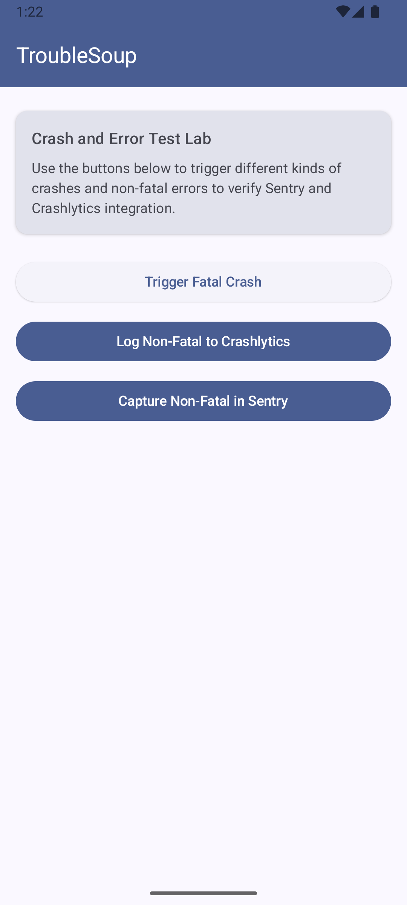

# AI Here Crashlytics Notifier

An Android sample app demonstrating end-to-end error tracking with Sentry and (optional) Firebase Crashlytics using Jetpack Compose. It includes buttons to intentionally trigger fatal and non-fatal errors so you can verify your observability pipeline.

## What’s inside
- Jetpack Compose UI
- Firebase Crashlytics SDK `20.0.2` (optional)
- Sentry Android SDK `8.21.1` and Sentry Gradle plugin `5.11.0`
- Android Gradle Plugin `8.10.0`, Kotlin `2.0.21`

## App UI actions
From the main screen (TroubleSoup), you can:
- Trigger Fatal Crash: throws a `RuntimeException` to verify crash capture in both Crashlytics and Sentry.
- Log Non-Fatal to Crashlytics: calls `FirebaseCrashlytics.recordException(..)`.
- Capture Non-Fatal in Sentry: sends a message and an exception to Sentry without crashing.
- Trigger Wrong Calculation Exception: runs a division-by-zero that throws a wrapped `RuntimeException`.

## Prerequisites
- Android Studio Jellyfish+ and JDK 17
- A Sentry account and project (recommended)
- A Firebase project with Crashlytics enabled (optional)

## Setup
1) Firebase (optional)
   - Download your `google-services.json` from the Firebase console and place it at:
     `app/google-services.json`
   - Google Services and Crashlytics Gradle plugins are already applied in `app/build.gradle.kts`.

2) Sentry (optional, recommended)
   - Ensure `sentry.properties` contains a valid auth token with Org/Project/Release write permissions. This repo expects the file at the project root: `sentry.properties`.
   - The Sentry Android SDK and Gradle plugin are configured in `app/build.gradle.kts`.

3) Sync & build
   - Open the project in Android Studio and let Gradle sync.
   - Or from terminal at the project root:
     ```bash
     ./gradlew :app:assembleDebug
     ```

## Run
- Select a device/emulator and run from Android Studio, or:
  ```bash
  ./gradlew :app:installDebug
  adb shell am start -n com.aiherecrashlyticsnotifier/.MainActivity
  ```

## Verify instrumentation
1) Launch the app and use the buttons to generate events.
2) Check destinations:
   - Sentry: Sentry project → Issues/Events. Non-fatals will appear as events without the app crashing.
   - Crashlytics (if enabled): Firebase console → Crashlytics → Issues.


## Useful Gradle tasks
```bash
# Clean and build debug
./gradlew clean :app:assembleDebug

# Install on a connected device
./gradlew :app:installDebug

# Build a release (configure signing first)
./gradlew :app:assembleRelease
```

## Screenshots
Add these images to `docs/` (or replace with your own URLs) so they render below:




## Troubleshooting
- Crashlytics shows nothing: verify `google-services.json` matches app id `com.aiherecrashlyticsnotifier` and device has network. Non-fatals may take minutes to appear.
- Sentry shows nothing: verify your DSN/config and that the auth token in `sentry.properties` is valid for release uploads.
- Build issues after version bumps: sync Gradle and ensure Kotlin/AGP versions in `gradle/libs.versions.toml` are compatible.

## License
For demo/educational purposes.


